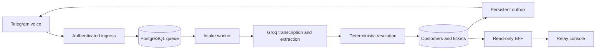

# Relay

AI-native IT service operations: turn an authorized Telegram voice message into a durable, structured support ticket.

Relay combines PostgreSQL-backed n8n workers, Groq transcription and extraction, deterministic customer resolution, and a read-only operational web console. **[v1.0.0 is released](https://github.com/aminewe898/relay/releases/tag/v1.0.0)**. Fresh packaged provider acceptance was explicitly deferred; review the release entry and [the release checklist](docs/release-checklist.md) for the accepted limits and deployment responsibilities.

## How it works



Durable checkpoints, leases, fencing and idempotency protect retries. Missing email and ambiguous matches ask the operator. Critical priority requires confirmation. Uncertain Telegram sends require human reconciliation instead of blind resending. Maintenance bounds retention and recovery work.

The console reads actual database projections; it has no runtime demo fallback. Assets, external migration imports, business operations and write actions are not implemented. See [capability status](docs/migration-center.md). Production screenshots are deliberately excluded; no synthetic screenshot is supplied in this release candidate.

## Quick start

Requirements: Docker Engine/Desktop with Compose v2, Node.js 22.15 or later, a Telegram bot, a Groq account, and HTTPS ingress for a production webhook.

```sh
git clone https://github.com/aminewe898/relay.git relay
cd relay
cp .env.example .env
# Configure distinct local secrets and the reader URL; see docs/configuration.md.
sh scripts/setup.sh
# Windows: powershell -File scripts/setup.ps1
```

Open the authenticated console at `http://localhost:3100` and create an n8n owner at `http://localhost:5678`. Follow [installation](docs/installation.md), [n8n setup](docs/n8n-setup.md), and [Telegram setup](docs/telegram-setup.md). Workflow imports remain inactive until the operator publishes them. No setup script sends Telegram/Groq requests or activates workflows.

## Workflow overview

| Workflow | Responsibility |
| --- | --- |
| TI-00 | Validated non-secret configuration |
| TI-01 | Secret-authenticated ingress, authorized text/voice sanitation and persistence |
| TI-02 | One leased download/transcribe/extract stage per execution |
| TI-03 | Customer resolution, operator interactions and ticket finalization |
| TI-04 | Fenced Telegram delivery and uncertain-send handling |
| TI-05 | Bounded recovery, audio retention and interaction expiry |

Debug capture tooling is excluded from production architecture. Bind all credentials and subworkflow references after importing.

## Configuration and operation

[Configuration reference](docs/configuration.md) documents all environment variables and workflow settings. PostgreSQL is private. n8n stores its own state in a separate named volume using its default SQLite database; the application queue uses PostgreSQL 18.6. n8n is pinned to 2.40.5. A reverse proxy with HTTPS must expose only the intended ingress path and protect editor/console access.

Run `node scripts/ops.mjs verify-installation` for local readiness checks. See [troubleshooting](docs/troubleshooting.md), [architecture](docs/architecture.md), [security](docs/security.md), [backup/restore](docs/backup-restore.md), and [updates](docs/installation.md#updates).

## Development

```sh
npm ci
npm run check
cd frontend
npm ci
npm run check
```

See [development](docs/development.md) and [contributing](CONTRIBUTING.md). Never modify an already-applied migration. Use disposable databases and synthetic fixtures for testing.

## Roadmap

Future work may include multi-user authorization, ticket mutations, assets and reviewed external imports. These are not v1 capabilities.

## License

Relay is licensed under [Apache-2.0](LICENSE). n8n and other dependencies retain their own licenses; Relay's license does not relicense them.

## Verification evidence

See [portfolio validation](docs/PORTFOLIO_VALIDATION.md) for checks performed and explicit limits.

