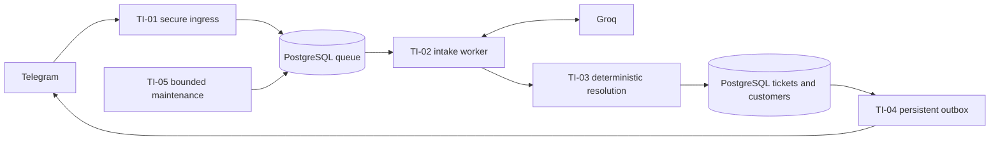
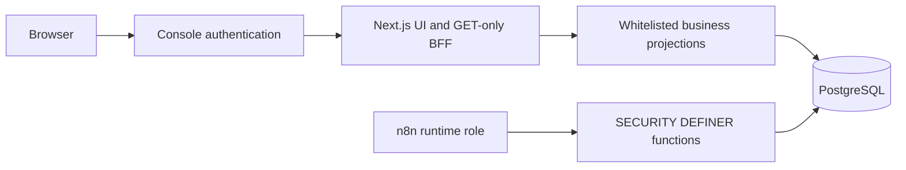
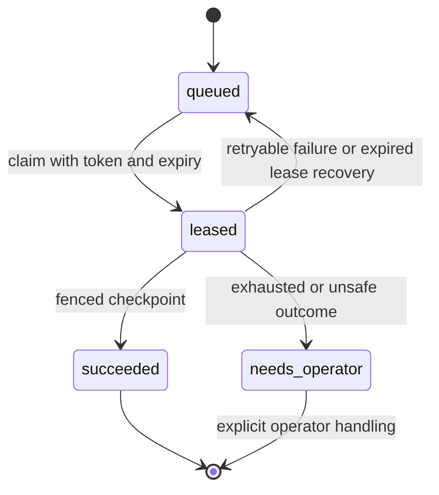

# Architecture

The database persists queue ownership and checkpoints independently of n8n executions. TI-02 executes one download, transcription or extraction stage, then persists the result. A new execution claims subsequent work. A lease allows recovery after a crash; token/revision fencing prevents a late worker from overwriting newer work. Ingress identities and delivery keys deduplicate messages and sends.

AI provides transcription and schema-validated incident suggestions, never authoritative customer IDs or unrestricted actions. Deterministic database functions resolve identities, require missing information, gate critical priority and atomically finalize tickets. Original transcript is retained as evidence; it may contain personal information.

The outbox tracks send attempts durably. A timeout or malformed provider result can mean a message was sent; ambiguous outcomes become uncertain and require reconciliation. They are never automatically retried as if definitely rejected.

TI-05 runs bounded maintenance. Database backend_policy controls audio hard retention and interaction expiry; audio purge does not imply transcript deletion. Backups may retain deleted audio. The browser receives selected business fields and aggregated service observations, never credentials, raw audio, lease tokens or raw provider payloads. Persisted observations do not prove current worker availability.

The packaged PostgreSQL role model is documented in security.md. Read-only BFF column privileges are separate from the workflow runtime's function-only privileges. No raw n8n state is needed by the frontend.
